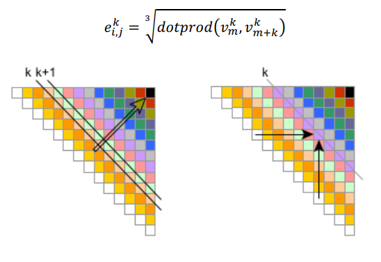

# SPM-project
Project of the Course Parallel and Distributed Systems, University of Pisa
Implementation of a parallel version of a matrix wavefront:
for each diagonal element of a square matrix $M$ ($N\times N$) of double precision
elements, we compute each the element in the superdiagonal $k$  as the dot-product of the same row and the same column of the element.



## Usage
1. **IMPORTANT**: run `setup.sh` in the `src` folder, to run FastFlow `mapping_string` (on a cluster node), and create necessary folders.

2. To compile the code, run the following command in the folder `src`:
```bash
make all
```
### Brief Explanations of Executables
Executables will be in the folder `out`.
- `sequential`: sequential wavefront. Usage: `./sequential <MATRIX_SIZE> `
- `check_correcness_ff`: check the correctness of FastFlow the wavefront computation. Usage: `./check_correctness_ff <MATRIX_SIZE> <N_WORKERS>`
- `compare_sequential`: compares different sequential version with increasing optimization. Usage: `./compare_sequential <MATRIX_SIZE>`
- `parallel_ff`: and `parallel_ff_block_cyclic`: two different FastFlow implementations (see the report). Usage: `parallel_ff <MATRIX_SIZE> <NUM_WORKERS>`, and `parallel_ff_block_cyclic <MATRIX_SIZE> <NUM_WORKERS> <CHUNK_SIZE> <ON_DEMAND>`
- `parallel_omp`: Parallel version with just OpenMP (not present in the report). 
- `weak_scaling`: runs the sequential implementation and the implementation in `parallel_ff`, but on a matrix of size $N\times \sqrt[3]{nworkers} $, where $N$ is chosen by the user. This is a (pretty naive) way I found to write a simple weak scaling test, without having to do floating point operations in shell scripts, which requires `bc` ( installed in the fontend node but not in the other nodes). Usage identical as `parallel_ff`.
- `parallel_mpi`: MPI wavefront implementation. Usage: `mpirun <MPIRUN_OPTIONS> parallel_mpi <MATRIX_SIZE> <OUT_FILE>`. Mainly used in  the script `run_mpi.sh` (see next).
- `parallel_mpi_omp`: MPI wavefront with loop over diagonal elements parallelized with OpenMP. Usage as `parallel_mpi`, choose the number of OMP threads setting the env variable `OMP_NUM_THREADS`.

### Scripts 
in the folder `scripts`  are available some scripts I used to run the code on the cluster. The scripts are:

- `strong_scaling_ff.sh`: runs the code on the cluster with a fixed matrix size and increasing number of workers.
Usage: `./strong_scaling.sh <matrix_size> <n_repetitions> <thread_list>`.  thread_list is to be given separated by commas.
Results will be in the file `results/strong_scaling_results.txt`.
- `weak_scaling_ff.sh`: runs the code on the cluster with a matrix size that increases with the number of workers.
Usage: `./weak_scaling.sh <initial_matrix_size> <n_repetitions> <thread_list>`. `initial_matrix_size` is the size of the matrix for 1 worker, and the size of the matrix for n workers is $N\times \sqrt[3]{nworkers} $, where $N$ is the `initial_matrix_size`.
Results will be in the file `results/weak_scaling_results.txt`.
- `sequential.sh`: runs the sequential code on the cluster with a fixed matrix size. Usage: `./sequential.sh <matrix_size>.` Results will be in the file `results/sequential_results.txt`.
- `run_mpi.sh`: Runs the MPI code on the cluster with a fixed matrix size the given number of workers. Usage: 
`sbatch --nodes=N run_mpi.sh <matrix_size> <processes_per_node>`. 
- `run_mpi_omp.sh`: Runs the MPI code with OMP on the cluster with a fixed matrix size the given number of workers. Usage:
`sbatch --nodes=N run_mpi_omp.sh <matrix_size> <processes_per_node>`.

### Results
When running the scripts, results will be found in the `results` folder, as a space separated values file, containing matrix, size, number of workers/processes, time taken and eventual other hyperparameters. 
